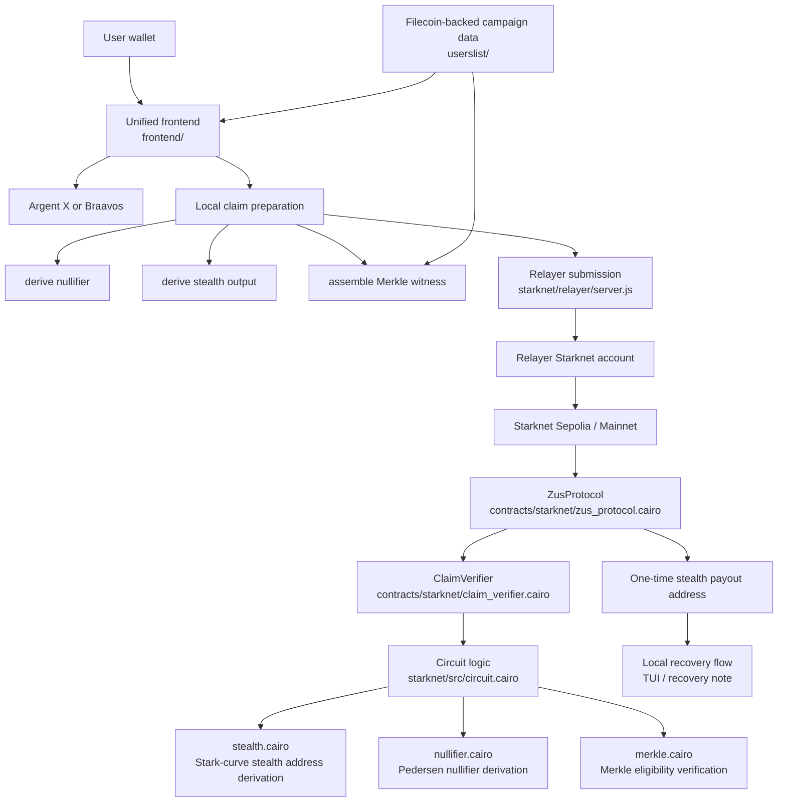

# ZUS Protocol Documentation

## Project Overview

ZUS Protocol is a **Fresh Code** hackathon project focused on a clear problem in onchain finance: reward distribution is usually fully public. In most airdrops, rebate systems, and campaign-based payouts, recipient lists and claim activity become visible onchain forever. That creates unnecessary privacy leakage for users and weakens the ability of projects to run rewards programs without exposing sensitive wallet-level metadata.

ZUS solves this by enabling **private reward distribution on Starknet**. Instead of publishing the full recipient list, a campaign creator stores only a campaign commitment onchain. Users then prove eligibility through a privacy-preserving claim flow and receive rewards without revealing the full distribution graph publicly. This makes the system verifiable and auditable while protecting recipient privacy.

## Filecoin Challenge Overview

For the Filecoin track, ZUS should be presented as a **Filecoin-backed coordination and state layer for private reward agents and Starknet claim execution**. The core idea is that campaign metadata, recipient sets, Merkle roots, and claim reconstruction data are published to and recovered from Filecoin-backed storage, while Starknet handles the final payout execution. This gives the project a decentralized data layer that independent clients can discover, verify, replay, and coordinate around without relying on a centralized database.

In challenge-language terms, ZUS aligns most closely with:

- `Onchain Agent Registry`, because campaign metadata, execution context, and logs can be reconstructed from Filecoin-backed records and shared across multiple clients
- `Agent Reputation & Portable Identity`, because claim state and eligibility history are portable, verifiable, and reconstructible from published Filecoin data

The strongest Filecoin submission framing is:

`ZUS uses Filecoin as the persistent state and discovery layer for private reward coordination, allowing independent clients, relayers, and operator tools to reconstruct campaign truth from decentralized storage while claims execute on Starknet.`

## Starknet Challenge Overview

For the Starknet privacy track, ZUS should be presented as a **private payment and confidential reward application built on Starknet infrastructure**. The Starknet branch of the project rebuilds the claim path in Cairo and uses Starknet-native cryptographic primitives to keep claimant identity private while still enforcing eligibility and one-time claims onchain.

The strongest honest Starknet framing is:

`ZUS is a Starknet-based private payment rail for reward and rebate flows, where users prove eligibility, route payouts to one-time stealth addresses, and use a relayer so their primary wallet is not exposed as the onchain caller.`

Because this Starknet bounty is focused on privacy within the Bitcoin ecosystem, the best submission positioning is:

- ZUS is a `private payment app leveraging Starknet infrastructure`
- the same shielded payout and relayed-claim model can support `BTC-linked incentives, wrapped BTC rewards, or Bitcoin-adjacent private payout flows`
- the current repo demonstrates the `privacy and Starknet execution infrastructure` directly, even though it is not a native Bitcoin L1 wallet product

## Starknet Requirement Fit

Against the Starknet sponsor requirements, the current repo maps as follows:

- `Open-source repository with functional code`: yes
- `Clear documentation`: yes, with architecture and implementation docs in this repo
- `Short demo video`: still required for final submission packaging
- `README with dependencies and run instructions`: yes, though the root README should be refreshed further if you want the Starknet path to be the lead narrative
- `Effective use of Starknet / ZK technology`: yes, through the Cairo contracts, verifier path, stealth derivation, nullifiers, Merkle verification, relayer flow, and Starknet wallet integration

The cleanest challenge-category fit is:

- `Private payment app leveraging Starknet infrastructure`

## Where Starknet Is Used In The Repo

The Starknet-specific infrastructure already exists in concrete parts of the codebase:

- `starknet/src/stealth.cairo`
  Derives a one-time Starknet stealth address using Stark-curve elliptic-curve operations and a private tweak path.
- `starknet/src/nullifier.cairo`
  Derives campaign-bound nullifiers with Pedersen hashing to prevent double-claiming.
- `starknet/src/merkle.cairo`
  Verifies Merkle membership proofs in Cairo.
- `starknet/src/circuit.cairo`
  Combines stealth derivation, nullifier derivation, and Merkle verification into the core claim logic.
- `starknet/src/verifier.cairo`
  Replays and verifies the claim logic against the submitted witness/public input structure.
- `contracts/starknet/zus_protocol.cairo`
  Main Starknet protocol contract handling campaigns, funding, and claims.
- `contracts/starknet/claim_verifier.cairo`
  Onchain verifier wrapper that exposes the Starknet verifier path.
- `starknet/relayer/server.js`
  Relays claims from its own Starknet account so the user does not broadcast directly from their main wallet.
- `frontend/starknet.js`
  Browser-side Starknet flow for local proof/witness preparation, stealth output derivation, and relayer submission.
- `frontend/App.jsx`
  Starknet is a first-class execution path in the unified frontend with wallet selection and Starknet-specific UI copy.
- `tui/src/main.rs`
  Includes Starknet stealth recovery tooling for local post-claim recovery.

## Starknet Infrastructure Diagram

## How ZUS Leverages Starknet Infrastructure

The Starknet path is not just a chain port. It specifically leverages Starknet infrastructure in the following ways:

- `Cairo contracts`
  The claim system was rebuilt in Cairo rather than wrapping an EVM verifier.
- `Stark-curve elliptic curve logic`
  Stealth address derivation is implemented on Starknet primitives.
- `Pedersen hashing`
  Nullifier derivation and Merkle path logic use Starknet-native cryptographic patterns.
- `Account abstraction`
  The relayer is a Starknet account that signs and submits the transaction while the claimant remains off the direct transaction path.
- `Starknet wallet ecosystem`
  The frontend supports Argent X and Braavos for Starknet users.
- `Starknet dev tooling`
  The repo includes Scarb builds, snforge tests, and Starknet deployment scripts.

## Recommended Starknet Submission Copy

If this project is being submitted under the Starknet privacy challenge, the cleanest challenge overview is:

`ZUS is a private payment app built on Starknet that lets users receive rewards without publicly exposing their main wallet. The Cairo protocol verifies eligibility with Merkle proofs, prevents replay with nullifiers, routes payouts to one-time stealth addresses, and uses a relayer so the claimant is not the visible onchain sender. This makes ZUS a strong Starknet-native privacy primitive for Bitcoin-adjacent payouts, wrapped BTC reward flows, and other confidential payment use cases.`

## Filecoin Requirement Fit

Against the Filecoin sponsor requirements, the current repo maps as follows:

- `Deploy to Filecoin Calibration Testnet`: yes, through the Filecoin campaign publishing and lookup flow in `userslist/`
- `Working demo`: yes, through the React frontend and the Rust TUI
- `Open-source GitHub submission`: yes
- `Demo video`: still required for final submission packaging

One requirement still needs to be handled explicitly before claiming full sponsor compliance:

- `Synapse SDK or Filecoin Pin in a meaningful way`: the current implementation uses a direct Filecoin RPC publishing and retrieval flow rather than an explicit Synapse SDK or Filecoin Pin integration. For final sponsor qualification, the Filecoin publish/retrieve path should be switched or wrapped to use one of those required tools directly.

## Where Filecoin Is Used In The Repo

The Filecoin-specific logic already exists in concrete parts of the codebase:

- `userslist/src/filecoin.rs`
  This is the Filecoin client layer. It serializes campaign payloads, posts campaign data to Filecoin testnet, fetches transactions back from Filecoin, decodes calldata, and reconstructs published campaign records.
- `userslist/src/merkle.rs`
  This layer rebuilds recipient sets, Merkle paths, and claim payloads from the published Filecoin campaign data, so the app can verify the same campaign state without a separate database.
- `userslist/src/main.rs`
  This exposes the API routes that the frontend and TUI use to create campaigns, fetch Filecoin-backed campaign records, and resolve claim payloads.
- `tui/src/main.rs` and `tui/src/types.rs`
  The TUI includes Filecoin transaction explorer and Filecoin claim lookup actions, letting an operator or claimant reconstruct campaign truth directly from a Filecoin transaction hash.
- `frontend/App.jsx`
  The UI frames Filecoin as the shared off-chain state layer for campaign and Merkle data across the Starknet payment path.

## Architecture

ZUS is built as an end-to-end stack:

- A **Rust backend** creates campaigns, builds Merkle trees, and serves claim data.
- A **Cairo claim stack** defines the Starknet privacy logic for membership verification, nullifier generation, and stealth address derivation.
- Onchain contracts on **Starknet** verify claims, prevent nullifier reuse, and execute payouts.
- A **relayer service** broadcasts the Starknet claim transaction so the user wallet is not the visible onchain sender.
- A **React frontend** provides campaign creation, Starknet wallet connectivity, and relayed claims.
- A **Rust TUI** supports local recovery and Filecoin-backed reconstruction tooling.

The project also includes campaign-linked storage and registry-style flows aligned with **Filecoin**, extending the design beyond simple contract interaction into broader data-backed reward infrastructure.

## Hackathon Tracks

This project is targeting the following tracks and challenge categories:

- `Fresh Code`
- `Filecoin`
- `Crypto`
- `Crecimiento`

## Sponsor Integrations

The core sponsor integrations in ZUS are:

- **Filecoin** for campaign publishing, payload recovery, Merkle reconstruction, and decentralized campaign truth
- **Starknet** for Cairo-based private claim execution, relayed submissions, nullifiers, and stealth payouts

## Recommended Submission Copy

If this project is being submitted under the Filecoin challenge, the cleanest challenge overview is:

`ZUS turns Filecoin into the shared state layer for private reward coordination. Campaign metadata, recipient sets, and Merkle proof data are published to Filecoin Calibration so independent clients can discover and reconstruct campaign truth, while Starknet handles payout execution. This makes reward infrastructure portable, verifiable, and privacy-preserving across multiple execution environments.`

## Summary

ZUS demonstrates how reward infrastructure can be private, practical, and user-friendly without sacrificing onchain verification. It is designed for use cases like private airdrops, loyalty campaigns, gated rebates, and stealth claim systems, showing how Starknet and Filecoin can support privacy-first distribution primitives with a complete working product built from fresh code.
